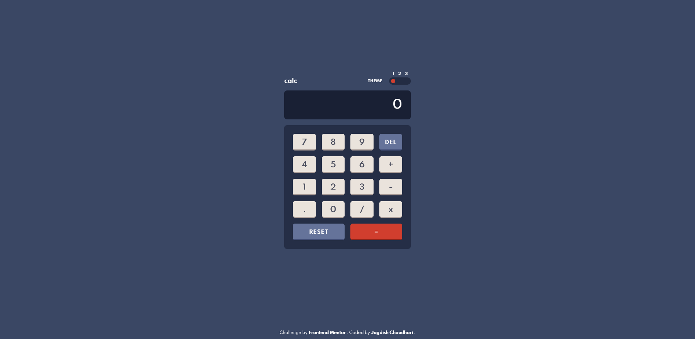
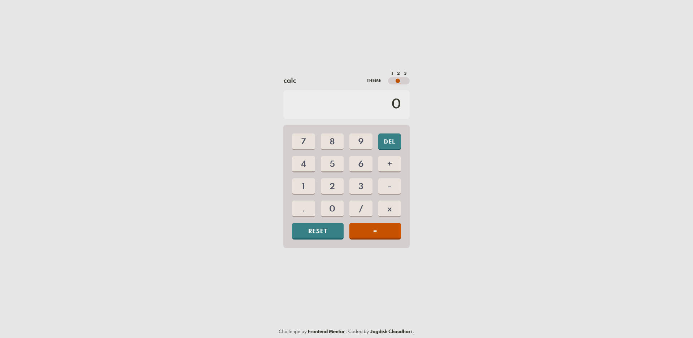
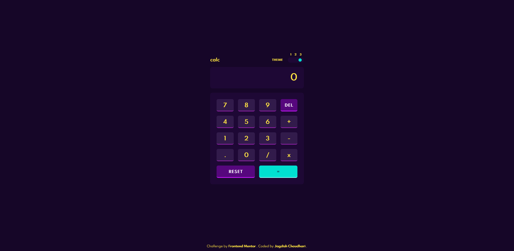

# Frontend Mentor - Calculator app solution

This is a solution to the [Calculator app challenge on Frontend Mentor](https://www.frontendmentor.io/challenges/calculator-app-9lteq5N29). Frontend Mentor challenges help you improve your coding skills by building realistic projects. 

## Table of contents

- [Overview](#overview)
  - [The challenge](#the-challenge)
  - [Screenshot](#screenshot)
  - [Links](#links)
- [My process](#my-process)
  - [Built with](#built-with)
  - [What I learned](#what-i-learned)
  - [Continued development](#continued-development)
  - [Useful resources](#useful-resources)
- [Author](#author)
- [Acknowledgments](#acknowledgments)

**Note: Delete this note and update the table of contents based on what sections you keep.**

## Overview

### The challenge

Users should be able to:

- See the size of the elements adjust based on their device's screen size
- Perform mathmatical operations like addition, subtraction, multiplication, and division
- Adjust the color theme based on their preference
- **Bonus**: Have their initial theme preference checked using `prefers-color-scheme` and have any additional changes saved in the browser

### Screenshot






### Links

- Solution URL: [GitHub](https://github.com/jc-oneseven/frontend-mentor_calculator-app/tree/challenge/calc)
- Live Site URL: [GitHub Page](https://jc-oneseven.github.io/frontend-mentor_calculator-app/)

## My process

### Built with

- Semantic HTML5 markup
- CSS custom properties
- CSS Variables
- CSS Grid
- Mobile-first workflow
- Pure JavaScript with ES6 concepts

### What I learned

During planning and coding this challenge, I come to know a lot of basics of JavaScript concepts and coding practices. Also, I have used ES6 concepts to void loops and making it more effiecient.

For example: I don't wanted to get reference of different radio buttons in 3 consts, so here what I have done using getting elements by class name:

```html
<div class="app-calc__theme-selection"> 
  <!-- Theme A - 01 -->
  <input type="radio" checked name="theme" id="darkTheme" class="btn-theme-selections">
  <label title="Choose Theme A" for="darkTheme"></label>
  <!-- Theme B - 02 -->
  <input type="radio"  name="theme" id="lightTheme" class="btn-theme-selections">
  <label title="Choose Theme B" for="lightTheme"></label>
  <!-- Theme C - 03 -->
  <input type="radio" name="theme" id="customTheme" class="btn-theme-selections">
  <label title="Choose Theme C" for="customTheme"></label>
</div>
```
```css
.proud-of-this-css {
  color: papayawhip;
}
```
```js
const [themeDark, themeLight, themeCustom] = document.getElementsByClassName(
  "btn-theme-selections"
);
```

As your can see in above HTML code snippet, I was trying to implement [BEM methodology](https://en.bem.info/methodology/) for CSS classes. And I wanted to continue work on BEM standards to deep div into it.

### Continued development

The only pending task is to add more life in this calculator that, user can use this calc using keyboard only. I'll update this document once I am done with pending task.


### Useful resources

- [CSS Grid](https://www.w3schools.com/css/css_grid.asp) - This helped me for lay this calculator our quickly. I really liked this pattern and will use it going forward.
- [BEM Methodology](https://en.bem.info/methodology/) - This is an amazing standards which helped me writting clear and managable CSS class name. I'd recommend it to anyone still learning this concept.


## Author

- Website - [Jagdish Chaudhari](http://jagdishchaudhari.co.in/)
- Frontend Mentor - [@jc-oneseven](hhttps://www.frontendmentor.io/profile/jc-oneseven)
- YouTube - [Jagdish Chaudhari](https://www.youtube.com/channel/UCpNQJmysPr8aqR_OVK_xVQQ)
